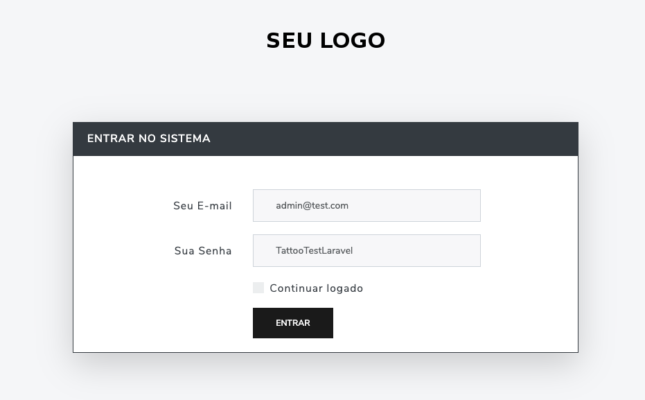
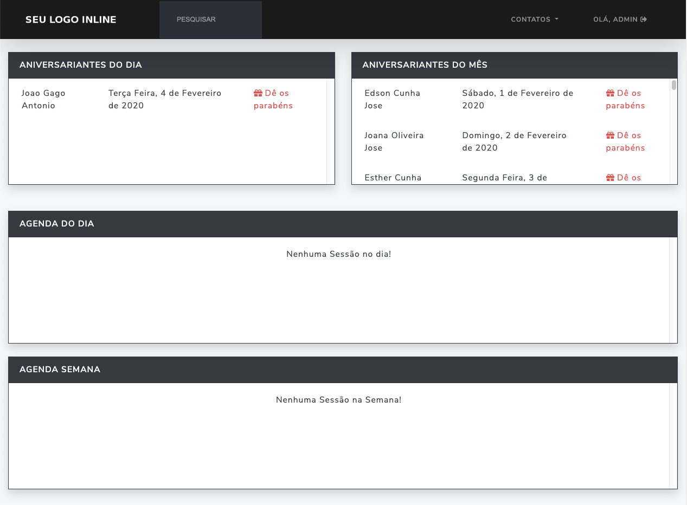
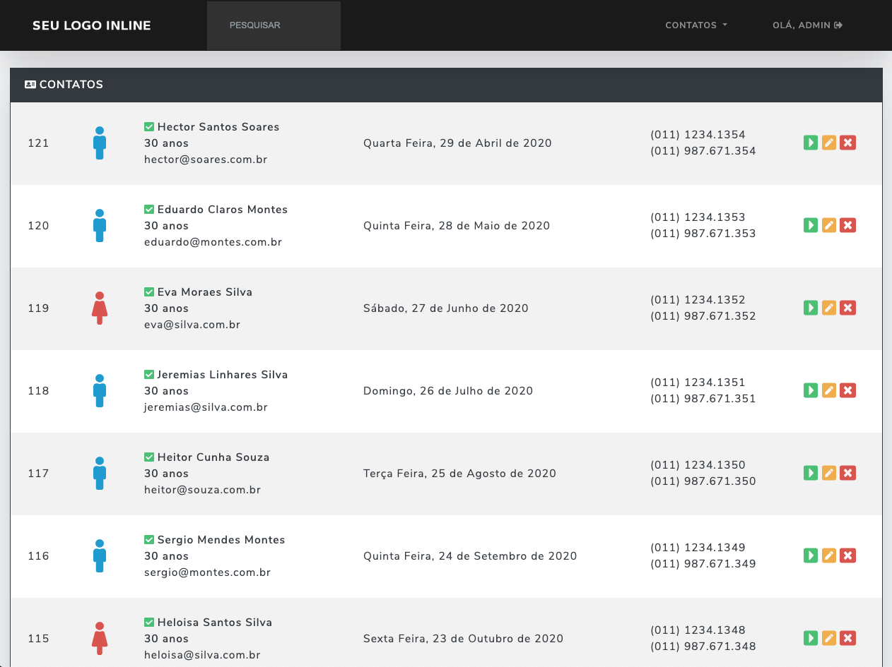
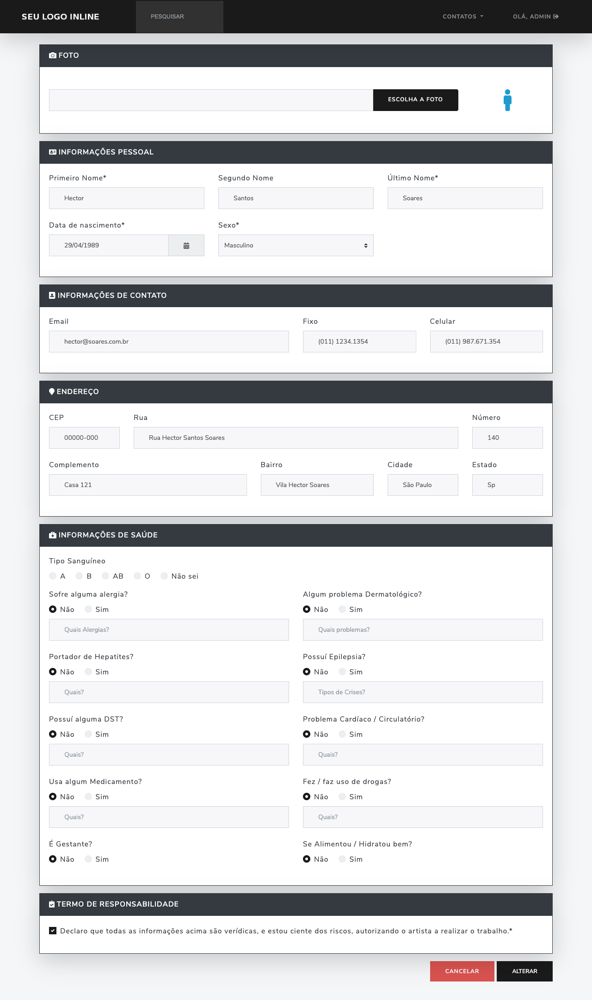
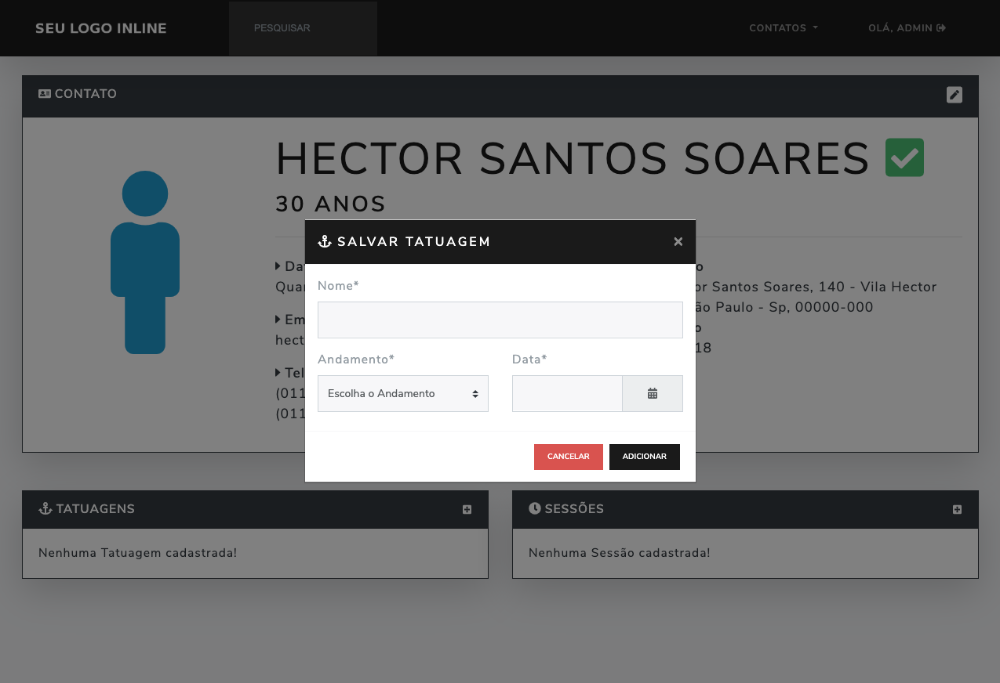

<!-- Info Header -->
<table>
  <tr>
    <td>
      
    </td>
    <td>
      <h3>
        Sistema simples de Cadastro de Contatos para Estúdios de Tatuagens
      </h3>
      
Projeto criado para atender uma demanda simples de Agenda de Contatos e Sessões de tatuagens.

      

        
        
      

      <p">
        <a href="#telas-do-sistema">Telas do Sistema</a>&nbsp;&nbsp;&nbsp;|&nbsp;&nbsp;&nbsp;
        <a href="#descricao">Descrição</a>&nbsp;&nbsp;&nbsp;|&nbsp;&nbsp;&nbsp;
        <a href="#sistema-online">Sistema Online</a>
      

    </td>
  </tr>
</table>

#### Telas do Sistema

    

    

    

    

    

---

#### Descrição

Criei um sisteminha bem simples de cadastro de contatos e sessões e tatuagens, apliquei laravel mix apenas para concatenar os arquivos e deixar a pasta /public livre.

Trabalhei com Presenters, o sistema é bem simples, apenas para estudos mesmo, pretendo ir adicionando mais camadas de estudos como ACL, DDD, entre mais, mas tudo com calma e ir aprendendo.

Fiquem a vontade para criticarem e dizer o que pode melhorar e o que pode estar errado ou certo.

**Obs.:** para criar o usuário admin, depois de rodar as migrations rode o seeder que ele vai criar um usuário *admin@test.com* / *TattooTestLaravel*

Para popular, tem como fazer via csv, eu até poderia criar um factory mas tem umas funções bem bacana do cadastro como autocompletar pelo cep, data de aniverário... então preferi deixar sem.

---

#### Sistema Online

**[Link do Sistema](https://tattoo.cajucomunica.com.br/)**
